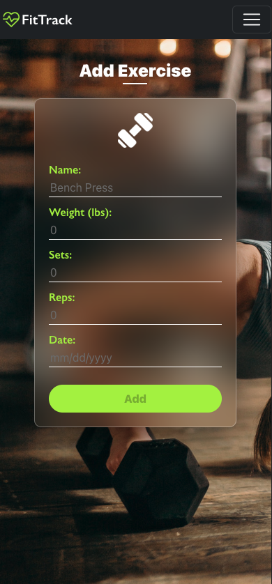

# FitTrackPro

A MERN-stack fitness tracker app.

## Description:

FitTrackPro is a cross-platform health and wellness application designed to integrate fitness tracking, nutritional guidance, and mental health resources into one accessible platform. Unlike existing applications, which often focus on one aspect of health, FitTrackPro offers a holistic approach, enabling users to manage their well-being from any device, whether mobile or desktop.

## Technology:

Project is created with:

- Mongoose
- Express.js
- React.js
- Node.js
- JWT Authentication

## Installation

To run this project, install it locally using npm:

npm install

## Usage

After installing npm packages, the application will be invoked by using the following command:

npm run develop

#### Example Screenshot

- Home Page  
  

- Login Page  
  

- Exercise Page  
  

- Add Cardio  
  

- Add Resistance  
  

- History Page  
  

- Single Cardio History  
  

- Single Resistance History  
  
